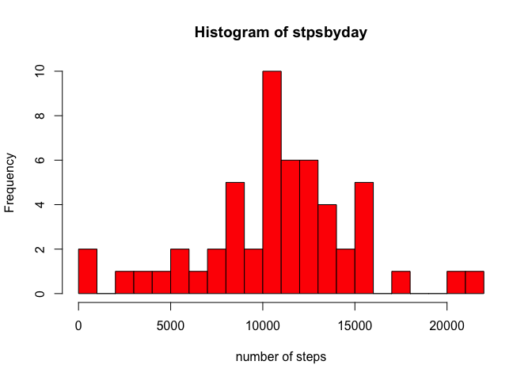
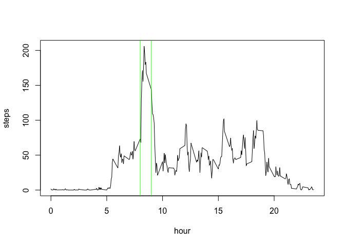
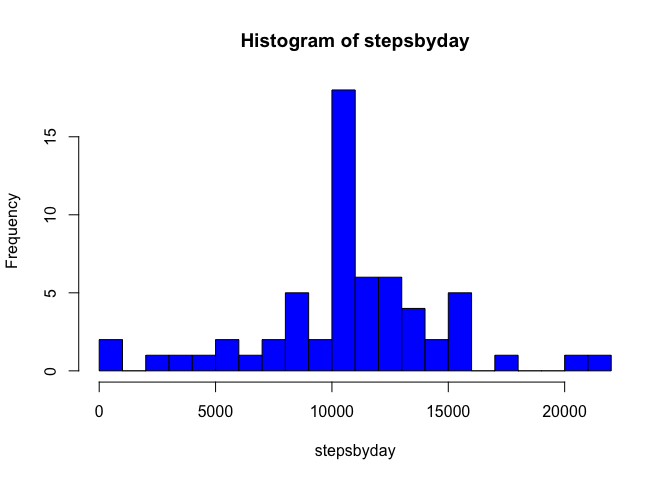
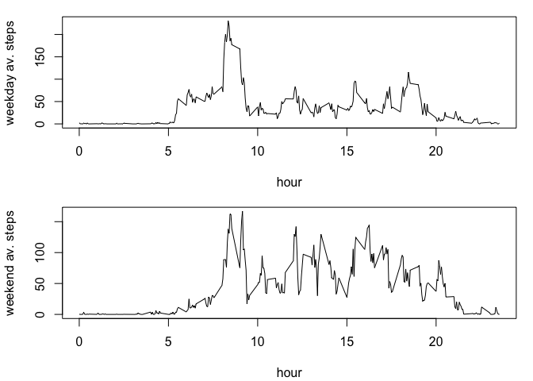

## Dataset

The dataset "Activity monitoring data" is downloaded through the following code:

```r
library(dplyr)
```

```
## 
## Attaching package: 'dplyr'
```

```
## The following objects are masked from 'package:stats':
## 
##     filter, lag
```

```
## The following objects are masked from 'package:base':
## 
##     intersect, setdiff, setequal, union
```

```r
library(lubridate)
```

```
## 
## Attaching package: 'lubridate'
```

```
## The following object is masked from 'package:base':
## 
##     date
```

```r
library(downloader)
library(ggplot2)
file.create("data.zip")
```

```
## [1] TRUE
```

```r
dataUrl <- "https://d396qusza40orc.cloudfront.net/repdata%2Fdata%2Factivity.zip"
download(dataUrl, dest="data.zip", mode="wb")
unzip ("data.zip", exdir = "./")
file.remove("data.zip")
```

```
## [1] TRUE
```

```r
data <- read.csv("activity.csv")
```

## Analysis

The following code removes missing values, computes the average number and the median number of steps in a day, and draws a histogram of the distribution of the number of steps in a day:

```r
df <- data[!is.na(data$steps),]
dfbyday <- group_by(df, date)
stpsbyday <- summarize(dfbyday, sum(steps, na.rm = TRUE))[,2]
stpsbyday <- as.numeric(unlist(stpsbyday))
hist(stpsbyday, breaks=20, col = "red", xlab="number of steps")
```

<!-- -->

```r
mean(stpsbyday)
```

```
## [1] 10766.19
```

```r
median(stpsbyday)
```

```
## [1] 10765
```


The following code produces the time-series plot of the average number of steps taken daily:

```r
dfbyint <- group_by(df, interval)
stpsbyint <- summarize(dfbyint, mean(steps))
stpsbyint <- mutate(stpsbyint, interval = interval / 100)
plot(stpsbyint$interval, stpsbyint$`mean(steps)`, type="l", xlab="hour", ylab="steps")
abline(v=9, col="green")
abline(v=8, col="green")
```

<!-- -->

The maximum is reached between 8 and 9 in the morning (marked by the two green vertical lines), presumeably when people go to work. 

The following code computes the total number of missing values in the dataset and imputes missing data by filling in the average number of steps taken in a given interval when the number of steps is missing for a given day. Finally, the same histogram as above is produced based on such imputed dataset. Note also that mean and median of the imputed dataset are very close to those of the original dataset (which makes mathematically good sense given our fill-in strategy), and that the distribution is just a scaled-up version of the previous one.


```r
sum(is.na(data$steps))
```

```
## [1] 2304
```

```r
data <- mutate(data, interval = interval / 100)

missrows <- which(is.na(data$steps)==TRUE)
for (i in 1:length(data$interval)) {
  if(i %in% missrows) {
  int <- data$interval[i] 
  data$steps[i] <- stpsbyint$`mean(steps)`[stpsbyint$interval==int]
  } # else {}
}

databydate <- group_by(data, date)
stepsbyday <- summarize(databydate, sum(steps))[,2]
stepsbyday <- as.numeric(unlist(stepsbyday))
hist(stepsbyday, breaks=20, col = "blue")
```

<!-- -->

```r
mean(stepsbyday)
```

```
## [1] 10766.19
```

```r
median(stepsbyday)
```

```
## [1] 10766.19
```

The following code considers weekdays and weekend separately, and plots the time series of each case separately. 


```r
weekday <- weekdays(ymd(data$date))
data <- cbind(data, weekday)
data <- mutate(data, weekday = factor((weekday == "Saturday" | weekday == "Sunday"), labels = c("weekday", "weekend")))


weekdaydf <- filter(data, data$weekday == "weekday")
weekenddf <- filter(data, data$weekday == "weekend")

weekday.means <- tapply(weekdaydf$steps, weekdaydf$interval, mean)
weekend.means <- tapply(weekenddf$steps, weekenddf$interval, mean)

par(mar=c(4.1,4.1,1.1,1.1), mfrow=c(2,1))

plot(names(weekday.means), weekday.means, type="l", xlab="hour", ylab="weekday av. steps")
plot(names(weekend.means), weekend.means, type="l", xlab="hour", ylab="weekend av. steps")
```

<!-- -->

